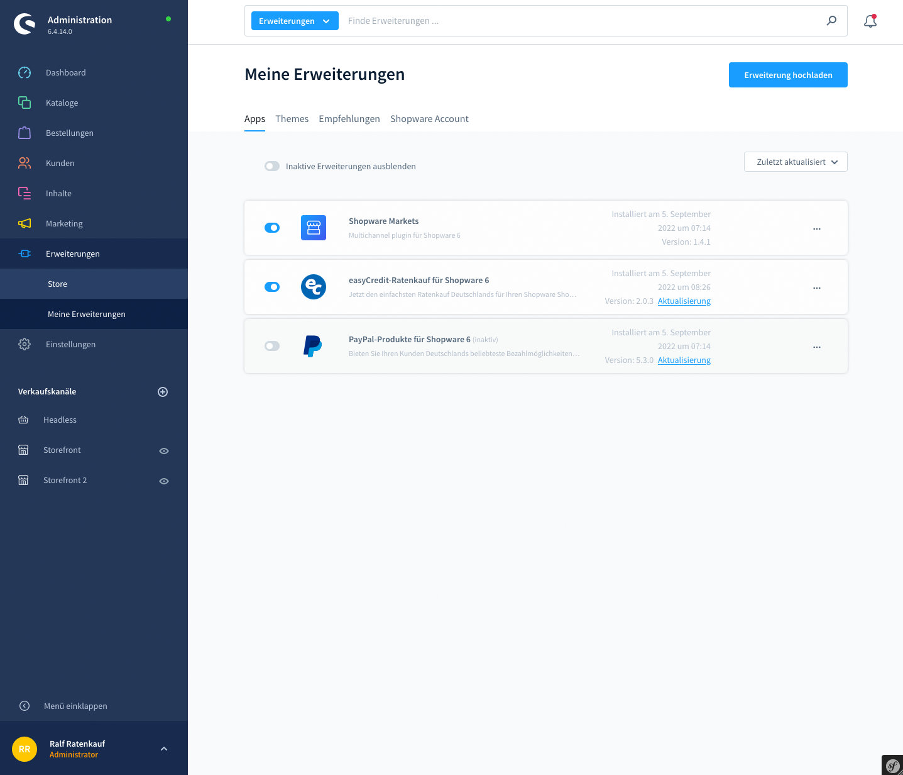
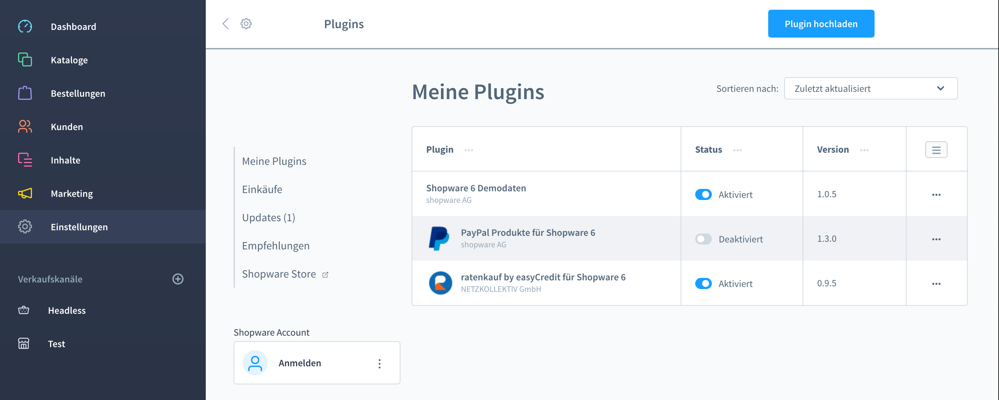

.. role:: latex(raw)
   :format: latex

Installation
============

Die Extension für easyCredit-Rechnung und Ratenkauf kann in der Administration unter :menuselection:`Erweiterungen --> Meine Erweiterungen` entweder über den direkten Download aus dem *Shopware Community Store* oder über den Datei-Upload des bereitgestellten Archives über *Erweiterung hochladen* installiert werden.
Alternativ ist auch die Installation über die Kommandozeile möglich.

Shopware Community Store
------------------------

Sie finden das Erweiterung im Shopware Community Store unter der folgenden URL:
https://store.shopware.com/easyc36021249341f/easycredit-ratenkauf-fuer-shopware-6.html

Legen Sie die Erweiterung in den Warenkorb und kaufen Sie es kostenlos unter der ihrer Lizenzdomain. In der Shopware-Administration sollte die Erweiterung nun unter :menuselection:`Erweiterungen --> Meine Erweiterungen` zu finden sein:

Die Erweiterung wird Ihnen nun unter „Erweiterungen -> Meine Erweiterungen -> Reiter "Apps"“ zur Installation angezeigt. Installieren Sie die Erweiterung durch Klick auf Installieren. Fahren Sie anschließend mit der Konfiguration fort.

manueller Datei-Upload
---------------------------------

Navigieren Sie in der Shopware-Administration zu :menuselection:`Erweiterungen --> Meine Erweiterungen`. Klicken Sie dort oben rechts auf den Button *Erweiterung hochladen*. Wählen Sie den lokalen Pfad aus, unter dem sich das ZIP-Archiv der Shopware Erweiterung befindet und bestätigen Sie.

Fahren Sie anschließend mit der :ref:`configuration` fort.

Kommandozeile
-------------

Um die Erweiterung über die Kommandozeile zu installieren, entpacken Sie diese nach:

.. code-block:: console

    $ unzip EasyCreditRatenkauf-x.x.x.zip -d custom/plugins/

Um sicher zu gehen, überprüfen Sie, ob das folgende Verzeichnis existiert: ``custom/plugins/EasyCreditRatenkauf``. Im Anschluss installieren und aktivieren Sie die Erweiterung mit den folgenden Befehlen:

.. code-block:: console

    $ cd /sw-base-dir
    $ ./bin/console plugin:refresh
    $ ./bin/console plugin:install EasyCreditRatenkauf
    $ ./bin/console plugin:activate EasyCreditRatenkauf

Fahren Sie anschließend mit der :ref:`configuration` fort.

..
..  Sollten Ihnen die Zugangsdaten bereits vorliegen, können Sie diese gleich bei der Installation mit den folgenden Befehlen setzen:
..
.. //code-block:: console
..
..    $ ./bin/console sw:plugin:config:set NetzkollektivEasyCredit easycreditApiKey 1.de.1234.4321
..  $ ./bin/console sw:plugin:config:set NetzkollektivEasyCredit easycreditApiToken abc-def-ghi
