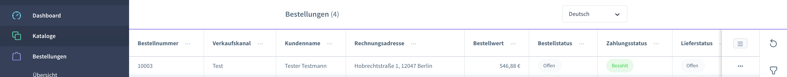
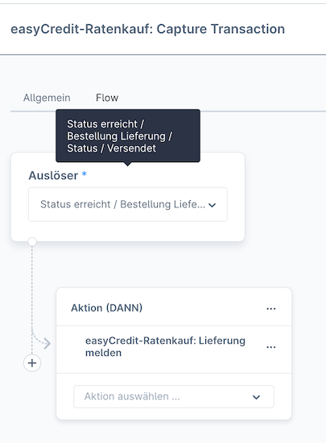
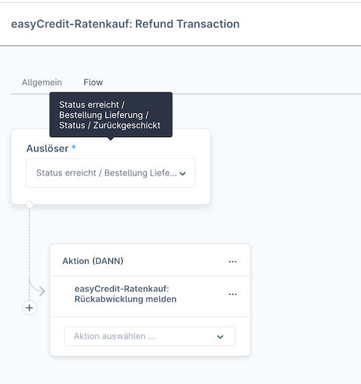

======================
Verwendung für Händler
======================

Eine neue Bestellung eines Kunden ist nach ihrem Eingang in Shopware gegenüber easyCredit genehmigt. Das heisst, die Zahlung und Bestellung wurde von easyCredit gegenüber dem Kunden bestätigt. Eine Auszahlung durch easyCredit an den Händler erfolgt erst, wenn der Händler die Lieferung der bestellten Artikel gemeldet hat. Dies erfolgt in Shopware entweder durch eine Bestätigung über die Transaktionsverwaltung oder durch eine Änderung des Bestellstatus gemäß folgender Einstellungen.

Alternativ ist die weitere Verwaltung des Transaktionsstatus über das `Partnerportal <https://partner.easycredit-ratenkauf.de/portal/>`_ möglich.

Transaktionsmanager
-------------------

Der Transaktionsmanager in der Detailansicht einer mit easyCredit bezahlten Bestellung zeigt eine Übersicht über die zur Bestellung gehörende Zahlungstransaktion und deren Historie. Über den Transaktionsmanager kann der Transaktionsstatus aus der Shopware Administration heraus direkt an easyCredit gemeldet werden.

Statusmeldung über den Transaktionsmanager
~~~~~~~~~~~~~~~~~~~~~~~~~~~~~~~~~~~~~~~~~~~~~~~~

Zur Meldung des Transaktionsstatus wählen Sie den gewünschten Status und senden Sie das Formular ab. Der Transaktionsmanager aktualisiert nach Absenden die Historie und die Transaktionsdetails oberhalb.

Bei Rückabwicklung wählen Sie bitte den Grund und geben Sie bei einer Teil-Rückabwicklung den entsprechenden Betrag ein.

Statusmeldung über die Bestellverarbeitung
----------------------------------------------------

Neben der expliziten Meldung über den :ref:`Transaktionsmanager` integriert die Extension die Statusmeldung auch in die Bestellverarbeitung von Shopware. Welcher Statusübergang welche Aktion auslöst, kann über den Shopware **Flow Builder** konfiguriert werden. Der **Flow Builder** ist nach Installation des Plugins wie im folgenden beschrieben konfiguriert. Der Flow Builder ist über die Einstellungen des easyCredit Plugins oder über die Shopware-Konfiguration wie folgt erreichbar:

*Einstellungen -> Shop -> Flow Builder*

Lieferung melden
~~~~~~~~~~~~~~~~~~~~~~~~~~~~~~~~~~~~~~~~~~~~~~~~

Die Änderung des Lieferstatus einer Bestellung auf "Versandt" löst in der Standardkonfiguration die Meldung der Lieferung an easyCredit aus. Der Transaktionsstatus ändert sich auf "In Abrechnung" und später auf "Abgerechnet". Die Flow Builder Action kann vom Händler an den eigenen Ablauf der Bestellverarbeitung angepasst werden.

.. note:: Die Meldung entspricht dem Status "Lieferung melden" über den Transaktionsmanager.

Rückabwicklung
~~~~~~~~~~~~~~~~~~~~~~~~~~~~~~~~~~~~~~~~~~~~~~~~

Wird der Lieferstatus einer Bestellung auf "Rückerstattet" geändert, wird die Transaktion in der Standardkonfiguration widerrufen bzw. rückgängig gemacht und an easyCredit gemeldet. Die Änderung ist ebenfalls im Transaktionsmanager als "Rückerstattet" ersichtlich.

.. note:: Die Meldung entspricht dem Status "Widerruf vollständig" über den Transaktionsmanager.

Anzeige des Transaktionsstatus
--------------------------------------

Der Transaktionsstatus kann einen der folgenden Werte annehmen:

* Wartend: die Transaktion ist noch nicht verfügbar. Es kann bis zu einem Tag dauern bis die Transaktion verfügbar ist.
* Lieferung melden: Die Transaktion ist vorhanden. Die Lieferung kann gemeldet werden.
* In Abrechnung: Die Lieferung wurde gemeldet. Die Auszahlung an den Händler wird bearbeitet.
* Abgerechnet: Die Auszahlung an den Händler ist erfolgt.
* Rückerstattet: Die Transaktion wurde widerrufen.
